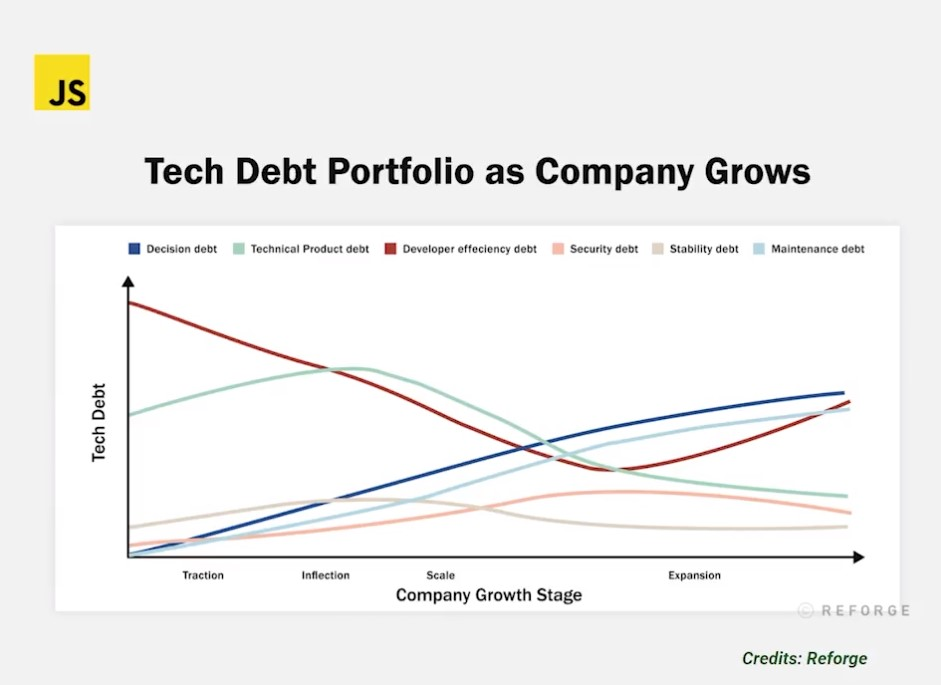

# ¿Qué es el testing?
En el mundo actual las tecnologias con las que vivimos necesitan codigo, esto ha hecho que el desarrollo de software se haya vuelto industrial, donde contamos con procesos y herramientas, como el testing, que nos permiten entregar mas rapido proyectos de calidad a nuestros clientes reduciendo el riesgo de errores en produccion.

# ¿Por que hacer testing?
Normalmente hay cuatro fases en el desarrollo de software para crear un producto:

> Diseño ⇒ Desarrollo ⇒ Pruebas ⇒ Produccion

En estas fases, detectar un error se vuelve cada vez mas costoso. Ahi es donde hacemos tecnicas para prevenir estas situaciones. El testing es la manera en la que nosotros gestionamos el riesgo y tratamos de evitar, en la medida de lo posible, los errores en el sistema.

> Gestionar riesgos como Google:
	-	Analisis de codigo estatico: Mientras desarrollamos vamos viendo nuestros resultados.
	-	Pruebas unitarias: Nos aseguramos que el codigo funciona como queremos.
	-	Pruebas de integracion: Verificar que varios elementos funcionan bien trabajando juntos.
	-	Revision de codigo: Equipo o persona encargada de revisar el codigo de las demas personas.
	-	QA: Equipos de creacion de pruebas automaticas o manuales.

## Fases en el desarrollo de software
1 - Diseño
2 - Desarrollo
3 - Pruebas
4 - Producción

El encontrar los errores seran mas oportunos si se encuentran en las primeras fases y mas complicados de corregir si se encuentran en las ultimas fases.

# Como gestionar los riesgos segun Google:

	-	Analisis de codigo estatico: En el editor mientras se desarrolla.
	-	Pruebas unitarias: probar nuesto codigo con pruebas
	-	Pruebas de integración: como se combinan dos bloques o funcionalidades en conjunto despues de haber cumplido con su función en individual.
	-	Revision de codigo
	-	QA(Pruebas de testers): Pruebas automaticas o manuales

# Reducir el riesgo a subir errores a produccion con test en desarrollo, entre mas temprano encontremos los bugs mas rapido los solucionamos

> 2 Unit tset 0 integracion test

# Piramide del testing

```js
	 <<UI>>      -> Mas lentas, costas pero pocas en comparacion con la base
 <<SERVICE>>			-> Pruebas de integracion,componentes,APIS( mas complejas mas costosas, mas dificiles de configurar pero son en menor cantidad)
<<<><Unit><>>>    -> Mas rapidas pero menos costosas( pero son la base )
```

> La pirámide clásica del testing: (de menos a más costoso y tendría que haber más pruebas de las primeras que de las últimas)

Menor
|| -	Unit tests
|| -	Integration tests
|| -	End to End tests (e2e)
|| -	UI test: emulan el dispositivo físico
||
||  En javascript se recomienda en vez la pirámide el trofeo de tests:
|| -	Static Tests: el tronco (el segundo mayor número de pruebas)
|| -	Unit Tests: mismo num. de pruebas que e2e y menos que static e integration
|| -	Integration tests: el mayor número de pruebas debe ser aquí
\\/ -	e2e tests: mismo tamaño que unit tests y menos que static e integration
Mayor

# Deuda tecnica (palanca estrategica pero que al final se tiene que pagar)
[deuda_tecnica](https://www.reforge.com/blog/managing-tech-debt)

Igual que en las finanzas, las deudas no son buenas ni malas, solo son una estrategia para alcanzar algo y luego se paga.

## Haciendo pruebas(test) se maneja el riesgo

Menor($)
|| - Diseño 			(Mientras en fases mas tempranas de desarrollo encontremos errores bugs es mas rapido de solucionar, corregir)
|| - Desarrollo  	(Mientras en fases mas tempranas de desarrollo encontremos errores bugs es mas rapido de solucionar, corregir)
|| - Pruebas     	(Mientras en fases mas tempranas de desarrollo encontremos errores bugs es mas rapido de solucionar, corregir)
\\/ - Producción  (Mientras en fases mas tempranas de desarrollo encontremos errores bugs es mas rapido de solucionar, corregir)
Mayor($)

El momento y pruebas dependen de la fase en la que se encuentra la compañía:

	-	Tracción
	-	Inflexión
	-	Escala
	-	Expansión


# En que momento de la compañia nos encontramos? (ISA|SIER) ?

La deuda de deficiencia del desarrollador puede ser alta porque en la fase de tracción, la compañía busca velocidad > precisión , de modo que en esta etapa el testing no se valora, ya que buscan lanzar, lanzar, lanzar…



Cuando se entra a la fase de inflexión, hay más usuarios y se empiezan a escribir más pruebas, curando la deuda.

En algun momento las pruebas se hacen necesarias e indispensables para curar la deuda y ganar eficiencia en desarrollo.

# Herramientas de testing (JavaScript).

Estas herramientas mencionadas están clasificadas según el tipo o nivel de pruebas a realizar.

#### :: Multipropósito o Robustas ::

Pueden ejecutar la mayoría de pruebas de la pirámide o trofeo, tanto para backend, frontend, integration test, algunas hasta UI y API s testing.
- Jest, _Chai, Mocha, Ava, Jasmine _

#### :: UI Testing ::
Pruebas desplegadas en un dispositivo real o simulado bajo un Browser (navegador) automatizando toques y gestos en la aplicación.
- Playwright, _ Cypress, WebdriverIO, Puppeteer_

#### :: API Testing ::
En general, las APIs no tienen UI, usan protocolos de servicios por peticiones.
-	Supertest, Dredd, Postman

#### :: Pruebas Estáticas ::
Estas pruebas no ejecutan el código, estas herramientas se integran al editor de código y van analizando si hay alguna mala práctica.
- ESLint, Prettier, Typescript tools (TSLint)

* Todas estas herramientas manejan una sola estructura (de forma), de modo que el lenguaje o framework pasa a un segundo plano.


# Ejemplo de pruena en Jasmine
```js
describe("A suite is just a function", () => {
	const a;
	it("and so is a spect", () => {
		a = true;

		expect(a).toBe(true);
	});
});
```

# Ejemplo de pruena en Jest :: se ve igual :: solo cambia el it por test
```js
describe("A suite is just a function", () => {
	const a;
	test("and so is a spect", () => {
		a = true;

		expect(a).toBe(true);
	});
});
```


# Matchers :: son las herramientas que se usan para comparar valores o ciertos escenarios.

```js
// Jasmine
it('null', () => {
	const n = null;
	expect(n).tobenull();
	expect(n).tobedefined();
	expect(n).not.tobeundefined();
	expect(n).not.tobetruthy();
	expect(n).tobefalsy();
})

// Jest
test('null', () => {
	const n = null;
	expect(n).tobenull();
	expect(n).tobedefined();
	expect(n).not.tobeundefined();
	expect(n).not.tobetruthy();
	expect(n).tobefalsy();
})
```


```js
/****************************************************************
*                         *::CONSOLA::*                         *
****************************************************************/
// src/demos
λ npm install --save-dev jest
λ npm install @babel/preset-env --save-dev


/****************************************************************
*                        *::TYPESCRIPT::*                       *
****************************************************************/
// src/demos/sum.ts
export const sum = (a:number, b:number): number => a + b


/****************************************************************
*                           *::SUM::*                           *
****************************************************************/
// src/demos/sum.js
export const sum = (a, b) => a + b


/****************************************************************
*                      *::PACKAGE:JSON::*                    *
****************************************************************/
// package.json
"type": "module",
"scripts": {
	"test": "jest --watch"
},
"jest": {
	"transform": {
		"^.+\\.[t|j]sx?$": "babel-jest"
	}
},


/****************************************************************
*                          *::BABEL::*                          *
****************************************************************/
// babel.config.js
{
  "presets": ["@babel/preset-env"]
}


/****************************************************************
*                    *::EJECUTANDO|TEST::*                      *
****************************************************************/
λ npm run test
```


```js
/****************************************************************
*                      *::OTHER|TESTS::*                        *
****************************************************************/
import  { mod, sum, subt, mult, div } from './02_math';

test('add 1 + 3 should be 4', () => {
	const result = sum(1, 3);
	expect(result).toBe(4);
}) ✅

test('add 1 - 3 should be 2', () => {
	const result = subt(1, 3);
	expect(result).toBe(-2);
}) ✅

test('add 1 * 3 should be 3', () => {
	const result = mult(1, 3);
	expect(result).toBe(3);
}) ✅

test('add 1 / 3 should be ?', () => {
	const result = div(1, 3);
	expect(result).toBe(0.3333333333333333);
	// expect(result).toBe(1); // -> Failed  ❌
}) ✅

test('add 1 % 3 should be ?', () => {
	const result = mod(1, 3);
	expect(result).toBe(1);
}) ✅
```

# Pruebas estaticas

```js
Para instalar eslint: 🤖
npm install -D eslint

Para configurarlo:
npx eslint --init

// .eslintrc.cjs
module.exports = {
	'env': {
		'browser': true,
		'es2021': true,
		'jest': true // 👍 💯
	},
	'extends': 'eslint:recommended',
	'parserOptions': {
		'ecmaVersion': 'latest',
		'sourceType': 'module'
	},
	'rules': {
		'indent': [
			'error',
			'tab'
		],
		'linebreak-style': [
			'error',
			'windows'
		],
		'quotes': [
			'error',
			'single'
		],
		'semi': [
			'error',
			'never'
		]
	}
}
```

#### Assertions / matchers

```js
/****************************************************************
*                        *::MATCHERS::*                         *
****************************************************************/
/**
 * @see 04_matchers.test.js
 */
```

# Setup and Teardown

En Jest hay cláusulas para isolar las pruebas, donde un escenario de pruebas no afecte a otro, para ello se agrupan los casos con describe().
Teardown se trata de demoler o quitar casos de prueba anteriores para que no afecten en el actual al usar los hooks, que son sentencias adicionales según el tiempo de ejecución del grupo o los casos.

	-	beforeAll(): se ejecuta antes de todas las pruebas.
	-	beforeEach(): se ejecuta antes de cada prueba.
	-	afterEach(): se ejecuta después de cada prueba.
	-	afterAll(): se ejecuta después de todas las pruebas

```js
beforeEach() es muy útiles para cargar una precondición necesaria antes de ejecutar cada una de las pruebas del set.

beforeAll() es muy útiles para cargar una precondición necesaria antes de ejecutar un set de pruebas.

Con afterEach() podemos generar postcondiciones que ayuden a la prueba a quedar como si nunca se ejecutó y/o hacer que la siguiente prueba del set no se vea perjudicada por esta. Ejemplo hacer un logout al final de la prueba si la siguiente requiere hacer login.

afterAll() sirve para ejecutar una postcondicion despues de ejecutar todas las pruebas de
```

```js
/****************************************************************
*                       *::SETUP|TEARDOWN::*                    *
****************************************************************/
/**
 * @see 06_person.test.js
 */
```


> Nota:
> Todas estas funciones se ejecutan dentro del alcance del [scope](https://www.w3schools.com/js/js_scope.asp)

## El describe nos permite crear un bloque dentro del cual agrupamos nuestras pruebas.
## Podemos crear un bloque dentro de otro para organizar mejor nuestras pruebas.

# Tipos de pruebas

### Conceptos

#### SUT (System Under Test): Sujeto Bajo Prueba, por ejemplo, Person sería nuestro SUT, no necesariamente tiene que ser un sistema.

Validar: A la hora de validar resolvemos la siguiente pregunta: ¿estamos construyendo el sistema correcto?, por lo general, en la capa de requerimientos con el cliente y si le da valor a él.

Verificar: Cuando ya se hacen pruebas, se verifica teniendo en mente la pregunta: ¿estamos construyendo el sistema correctamente? casi obviando que ya se produce valor al cliente.

En todas las capas se pueden hacer pruebas, incluso sin código, como en los UML o en la revisión con el equipo de Scrum.

### Tabla capas Vs detalle

#### Pruebas Funcionales
Son las que validan que se cumplan los requerimientos de valor para el cliente (como guardar bien los buenos datos de un usuario); hasta este punto es lo que hemos hecho en VS code. Por norma general, las pruebas unitarias las entrega el desarrollador, el tester se empieza a involucrar en las pruebas de integración o E2E.

#### Pruebas No Funcionales
Verifican más el óptimo manejo de los recursos del software, no el cumplimiento de requisitos persé, como lo son pruebas de: +rendimiento +carga o estabilidad +estrés +usabilidad +seguridad. Estas pruebas no necesariamente deben estar desde el principio.

NOTA: HAy una nueva área de pruebas No Funcionales que se llama 🐒 Ingeniería del caos, 🐒 su pionero es Netflix. Consiste en desconectar servicios en producción, como por ejemplo, desconectar una BD para ver como reacciona el equipo y establecer soluciones.
⛔ ¡*Es muy pegrilossoo, MUY PEGRILOOSSOO!! ⛔

[Chaos_Mokey](https://netflix.github.io/chaosmonkey/)

Ingeniería del caos: o pruebas del caos, es una disciplina o enfoque para probar y construir un sistema que pueda soportar fallas o condiciones inesperadas.

# Metodologías

## TDD (Test Driven Development): Desarrollo guiado por pruebas, donde primero se hacen las pruebas antes de escribir el código (primero los expects).

## BDD (Behavior Driven Development): Desarrollo guiado por comportamiento de acuerdo a los requisitos y luego las pruebas, casos reales de comportamiento, lo que esperaria el usuario en caso de .

## AAA “Mantra” para hacer pruebas

```js
_____ preparar Arrange | Given dado algo
_________ ejecutar Act | When cuando
resolver hipótesis Assert | Then entonces
```

concepto Falso Positívo Cuando una prueba indica un error, pero todo está bien, por ejemplo, testeando el método suma de 1 +1 y pongo el expect en 5, es un falso positivo, luego la prueba está mal.

° Falso Negativo Son más comunes, ya que parece que todo está normal, pero no se ha identificado el error, el set de pruebas debería ser más amplio; esto sucede cuando caemos en tan solo, probar el Happy Path, probar las condiciones en las que sabemos que el sistema funciona, por ejemplo, en el SUT de dividir las primeras pruebas salían bien porque no se tomó en cuenta la división entre cero 0, luego se hizo la prueba y el refactor. En caso de falso negativo lo mejor es aplicar TDD.

° Sistema Legacy Son sistemas que te piden agregar pruebas a algo funcional, incluso en paralelo; hay que refactorizar los métodos enormes a pequeños para hacer unit test de pocos a muchos métodos; legacy no lleva una buena arquitectura.

° Clean Architecture Este patrón lleva buenas prácticas desde el principio, cada método está bien dividido y con responsabilidades acertadas, es mucho más facil de agregar el set de pruebas.

AAA podría verse como las acciones que ejecutamos al realizar una prueba.

Arrage: condiciones previas.

Act: los pasos a ejecutar.

Assert: verificar lo esperado.

Cuando empleamos BDD, debemos utilizar un lenguaje común (entendido por todo el equipo: técnico y de negocio) llamado Gherkin. Gherkin está compuesto por unas 20 palabras claves, siendo tres de ellas Given, When, Then.

Con esto quería hacer referencia a la semejanza entre estas tres keywords de Gherkin y las AAA.

```js
// Mantra -<>
// AAA, Preparar -> Actuar -> Acertar
// AAA, Arrange  -> Act    -> Assert
// AAA, Given    -> When   -> Then
// Mantra -<>

import { Person } from "./06_person";

describe('Test for Person', () => {
  let person;
  // Arrange
  beforeEach(() => {
    person = new Person('Nico Doe', 45, 1.7);
  });

  test('should return down', () => {
    // Arrange
    person.weight = 45;
    // Act
    const imc = person.calcIMC();
    // Assert
    expect(imc).toBe('down');
  });

  test('should return normal', () => {
    person.weight = 59;
    const imc = person.calcIMC();
    expect(imc).toBe('normal');
  });
});
```

# Pruebas unitarias

[Unit_test](https://martinfowler.com/bliki/UnitTest.html)

#### Pruebas Unitarias (Aisladas)

Son las más comunes y se enfocan en probar unidades específicas, incluso conectando dependencias como BD o librerías emuladas (Dummies); se les conoce también como pruebas de estado o de caja negra, ya que solo importan las entradas y las salidas, en algunas ocasiones se hace con dependencias reales.

Una unidad puede ser una función o un método o una clase, depende del paradigma usado en desarrollo (funcional o POO); una unidad debe tener solo una responsabilidad en específico.

Una utilidad importante de las Unit Test es el Cover Report (reporte de cobertura)…

#### Pruebas unitarias

Se pueden hacer pruebas unitarias de dos maneras:

##### de caja negra: no me importa lo que haga dentro
##### de caja blanca: tego en cuenta lo que hace dentro, lo verifico en la prueba

Las unidades que se testean deberían hacer una sola cosa (single responsability) y entonces aplicaríamos el testeo de caja negra. Si no es así, tendríamos que hacerlo como caja blanca.


# Reporte de Cobertura

Es una medida porcentual que indica cuanto falta probar del código que va a ir a producción, cuál ya está probado, cuál no se usa. ISO y la FAA exigen 100% de cobertura, pero en la realidad no es tan así, por ejemplo hacer test a setter y getters puede llegar a ser innecesario, este 100% no garantiza que aparezcan errores ni que sean el mejor set de pruebas.

```js
// package.json
"scripts": {
	"test": "jest --watch",
	"test:coverage": "jest --coverage",
	"test:math": "jest -- 02_math",
	"test:person": "jest -- 06_person",
	"lint": "eslint src/**/*.js",
	"lint:fix": "eslint src/**/*.js --fix"
}

$ npm run test:coverage

// output consola -<>
--------------|---------|----------|---------|---------|-------------------
File          | % Stmts | % Branch | % Funcs | % Lines | Uncovered Line #s
--------------|---------|----------|---------|---------|-------------------
All files     |   86.84 |    80.76 |     100 |      96 |
 01_sum.js    |     100 |      100 |     100 |     100 |
 02_math.js   |     100 |      100 |     100 |     100 |
 03_lint.js   |     100 |      100 |     100 |     100 |
 06_person.js |   78.26 |    80.76 |     100 |   93.75 | 28
--------------|---------|----------|---------|---------|-------------------

Test Suites: 6 passed, 6 total
Tests:       27 passed, 27 total
Snapshots:   0 total
Time:        4.12 s
// output consola -<>
```


## Importante nos muestra las lineas no testeadas o cubiertas en 06_person.js


#### 100% de COBERTURA es IGUAL a no tener ERRORES

# Tener un equilibrio para no hacer pruebas innecesarias

> NOTA: Reporte de cubertura: no quiere decir que todo este 100% probado.

> Supongo que quieres saber si cobertura hace referencia a que hay pruebas por archivo, y no exactamente, el reporte de Jest te verifica también si el código que tiene un archivo de pruebas tiene una prueba para todos los flujos posibles del código y te calcula el porcentaje

[Docker](https://docs.docker.com/desktop/windows/wsl/)

# Doubles

	-	Dummy: Son datos ficticios para llenar información.
	-	Fake: Son objetos que simulan comportamientos o datos; como un usuario ficticio.
	-	Stubs: Son proveedores o APIs de tatos preparados (BD Clima).
	-	Spies: Son como los stubs, pero se dejan espiar su comportamiento, comunicación e invocación.
	-	Mocks: Stubs + Spies, pueden estar pre-programados para enviar las respuestas supuestas.

```js
/****************************************************************
*                           *::MOCK::*                          *
****************************************************************/
/**
 * @see booksMock.service.test
 */
`
```

# Spies

Prueba de caja negra, entrada -> salida
Pruebas de caja blanca, entrada -> caja -> salida

```js
Generar informacion dinamica like faker
https://github.com/ngneat/falso
```

# Pruebas Integracion y end to end (Supertest)


```js
npm i supertest -D
```

normalmente encontramos estas pruebas en una carpeta aparte llamada e2e

```js
// jest_e2e.config.json
{
	"moduleFileExtensions": ["js"],
	"rootDir": ".",
	"testEnvironment": "node",
	"testMatch": [
		"**/e2e/**/*.test.js",
		".e2e.js$"
	]
}
```

